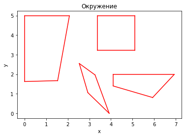
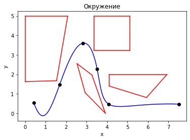

```python
import collections

import numpy as np
import matplotlib.pyplot as plt

import newton, utils
```


```python
# Выведем на экран окружение
given = utils.give_data()
fig1 = utils.give_lines(given.fig1)
fig2 = utils.give_lines(given.fig2)
fig3 = utils.give_lines(given.fig3)
fig4 = utils.give_lines(given.fig4)

ax = plt.axes()
ax.set(xlabel='x', ylabel='y', title='Окружение')
utils.plot_fig(ax, fig1)
utils.plot_fig(ax, fig2)
utils.plot_fig(ax, fig3)
utils.plot_fig(ax, fig4)
```


    

    


```python
# Выберем время прохождения траектории и опорные точки
TIME = (0, 4, 8, 12, 16, 20)
DOTS = (
    (0.42, 1.69, 2.81, 3.52, 4.08, 7.52),
    (0.55, 1.48, 3.60, 2.26, 0.47, 0.47)
)

# Найдем таблицу разделенных разностей (segmentation difference table)
# и построим функции движения по осям на ее основе
SDT_newton_x = newton.segmentation_difference(TIME, DOTS[0])
newton_func_x = newton.make_function(SDT_newton_x)
SDT_newton_y = newton.segmentation_difference(TIME, DOTS[1])
newton_func_y = newton.make_function(SDT_newton_y)
time = np.linspace(0, 20, 100)
newton_x = utils.give_array_with_func(newton_func_x, time)
newton_y = utils.give_array_with_func(newton_func_y, time)
```


```python
# Рисуем траекторию движения манипулятора в заданном окружении
ax = plt.axes()
ax.set(xlabel='x', ylabel='y', title='Окружение')
utils.plot_fig(ax, fig1)
utils.plot_fig(ax, fig2)
utils.plot_fig(ax, fig3)
utils.plot_fig(ax, fig4)
ax.plot(newton_x, newton_y, color='blue')
ax.plot(DOTS[0], DOTS[1], 'o', color='black')
plt.draw()
```


    

    


```python

```
